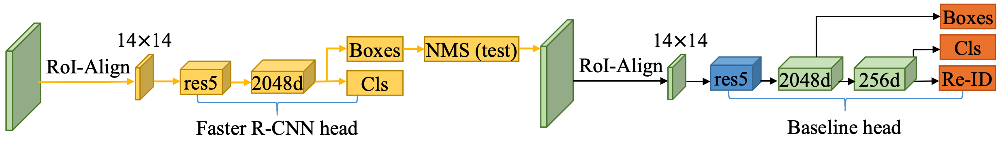

<div align="center">

</div>

**Pure SeqNet**:
[](https://paperswithcode.com/sota/person-search-on-prw?p=sequential-end-to-end-network-for-efficient)
[](https://paperswithcode.com/sota/person-search-on-cuhk-sysu?p=sequential-end-to-end-network-for-efficient)

**SeqNet with SOLIDER**:
[](https://paperswithcode.com/sota/person-search-on-prw?p=beyond-appearance-a-semantic-controllable)
[](https://paperswithcode.com/sota/person-search-on-cuhk-sysu?p=beyond-appearance-a-semantic-controllable)

This repository hosts the source code of our paper: [[AAAI 2021]Sequential End-to-end Network for Efficient Person Search](https://arxiv.org/abs/2103.10148). SeqNet achieves the **state-of-the-art** performance on two widely used benchmarks and runs at **11.5 FPS** on a single GPU. You can find a brief Chinese introduction at [zhihu](https://zhuanlan.zhihu.com/p/358152127).

SeqNet performance:

| Dataset   | mAP  | Top-1 | Model                                                        |
| --------- | ---- | ----- | ------------------------------------------------------------ |
| CUHK-SYSU | 94.8 | 95.7  | [model](https://drive.google.com/file/d/1wKhCHy7uTHx8zxNS62Y1236GNv5TzFzq/view?usp=sharing) |
| PRW       | 47.6 | 87.6  | [model](https://drive.google.com/file/d/1I9OI6-sfVyop_aLDIWaYwd7Z4hD34hwZ/view?usp=sharing) |

SeqNet with SOLIDER performance:

| Dataset   | mAP  | Top-1 | Model                                                        |
| --------- | ---- | ----- | ------------------------------------------------------------ |
| CUHK-SYSU | 95.5 | 95.8  | - |
| PRW       | 59.8 | 86.7  | - |

The network structure is simple and suitable as baseline:



## Updates

[**2023/04/10: [SOLIDER](https://github.com/tinyvision/SOLIDER) makes SeqNet better!**]: SOLIDER is a Semantic Controllable Self-Supervised Learning Framework to learn general human representations from massive unlabeled human images which can benefit downstream human-centric tasks to the maximum extent. With SOLIDER backbone, SeqNet achieves better results. Please refer to their repo for more details. Nice work!

## Installation

Run `pip install -r requirements.txt` in the root directory of the project.


## Quick Start

Let's say `$ROOT` is the root directory.

1. Download CUHK-SYSU ([google drive](https://drive.google.com/open?id=1z3LsFrJTUeEX3-XjSEJMOBrslxD2T5af) or [baiduyun](https://pan.baidu.com/s/1AYL_YPVVzGrVIrkOmBp5QQ?pwd=92v1)) and PRW ([google drive](https://goo.gl/2SNesA) or [baiduyun](https://pan.baidu.com/s/1U5YaSHuT6Cgl6xnjzh11Ow?pwd=q3q9)) datasets, and unzip them to `$ROOT/data`
```
$ROOT/data
├── CUHK-SYSU
└── PRW
```
2. Following the link in the above table, download our pretrained model to anywhere you like, e.g., `$ROOT/exp_cuhk`
3. Run an inference demo by specifing the paths of checkpoint and corresponding configuration file. `python demo.py --cfg $ROOT/exp_cuhk/config.yaml --ckpt $ROOT/exp_cuhk/epoch_19.pth` You can checkout the result in `demo_imgs` directory.


## Training

Pick one configuration file you like in `$ROOT/configs`, and run with it.

```
python train.py --cfg configs/cuhk_sysu.yaml
```

**Note**:
* If you are unable to reproduce our results, please check the PyTorch version. Related issues: https://github.com/serend1p1ty/SeqNet/issues/26 https://github.com/serend1p1ty/SeqNet/issues/29 https://github.com/serend1p1ty/SeqNet/issues/31 https://github.com/serend1p1ty/SeqNet/issues/32
* At present, our script only supports single GPU training, but it may support distributed training in the future. By default, the batch size and the learning rate during training are set to 5 and 0.003 respectively, which requires about 28GB of GPU memory. If your GPU cannot provide the required memory, try smaller batch size and learning rate (*performance may degrade*). Specifically, your setting should follow the [*Linear Scaling Rule*](https://arxiv.org/abs/1706.02677): When the minibatch size is multiplied by k, multiply the learning rate by k. For example:

```
python train.py --cfg configs/cuhk_sysu.yaml INPUT.BATCH_SIZE_TRAIN 2 SOLVER.BASE_LR 0.0012
```

* If your GPU memory is not enough, you can also try strategies such as mixed precision training (FP16), cumulative gradient, and gradient checkpoint. I have tried FP16, which can achieve the same accuracy while saving half of the GPU memory. Unfortunately, I lost this part of the code about FP16. Related PR is welcomed, I can provide some code implementation suggestions.

**Tip**: If the training process stops unexpectedly, you can resume from the specified checkpoint.

```
python train.py --cfg configs/cuhk_sysu.yaml --resume --ckpt /path/to/your/checkpoint
```

## Test

Suppose the output directory is `$ROOT/exp_cuhk`. Test the trained model:

```
python train.py --cfg $ROOT/exp_cuhk/config.yaml --eval --ckpt $ROOT/exp_cuhk/epoch_19.pth
```

Test with Context Bipartite Graph Matching algorithm:

```
python train.py --cfg $ROOT/exp_cuhk/config.yaml --eval --ckpt $ROOT/exp_cuhk/epoch_19.pth EVAL_USE_CBGM True
```

Test the upper bound of the person search performance by using GT boxes:

```
python train.py --cfg $ROOT/exp_cuhk/config.yaml --eval --ckpt $ROOT/exp_cuhk/epoch_19.pth EVAL_USE_GT True
```

## Pull Request

Pull request is welcomed! Before submitting a PR, **DO NOT** forget to run `./dev/linter.sh` that provides syntax checking and code style optimation.

## Citation

```
@inproceedings{li2021sequential,
  title={Sequential End-to-end Network for Efficient Person Search},
  author={Li, Zhengjia and Miao, Duoqian},
  booktitle={Proceedings of the AAAI Conference on Artificial Intelligence},
  volume={35},
  number={3},
  pages={2011--2019},
  year={2021}
}
```
